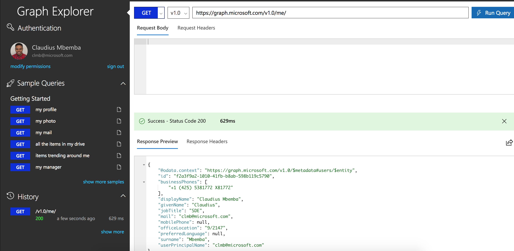
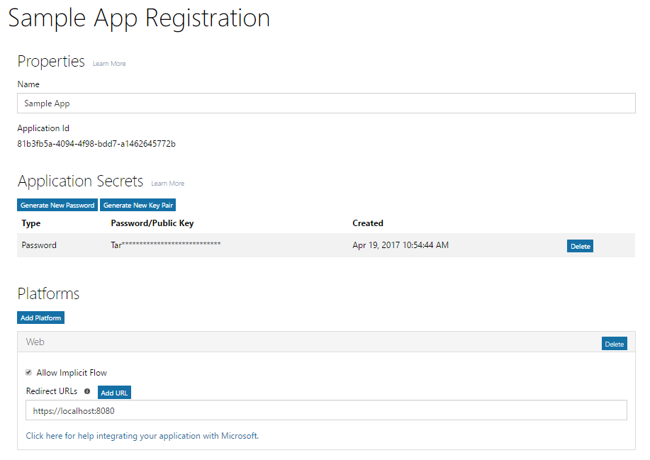
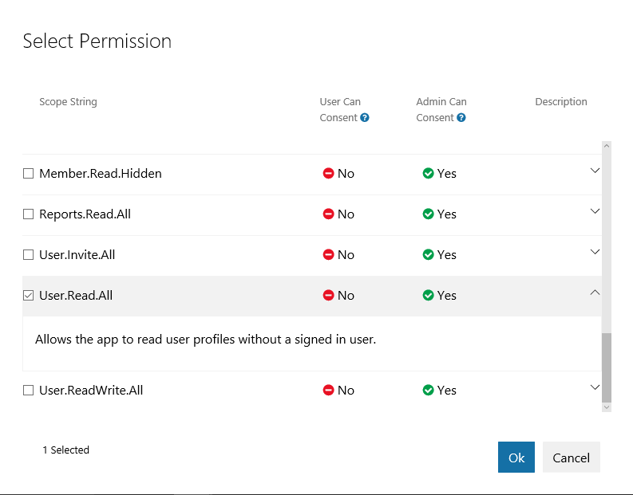
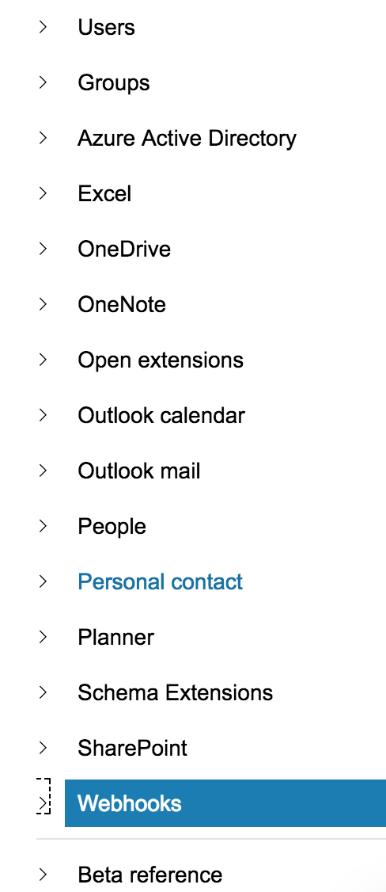
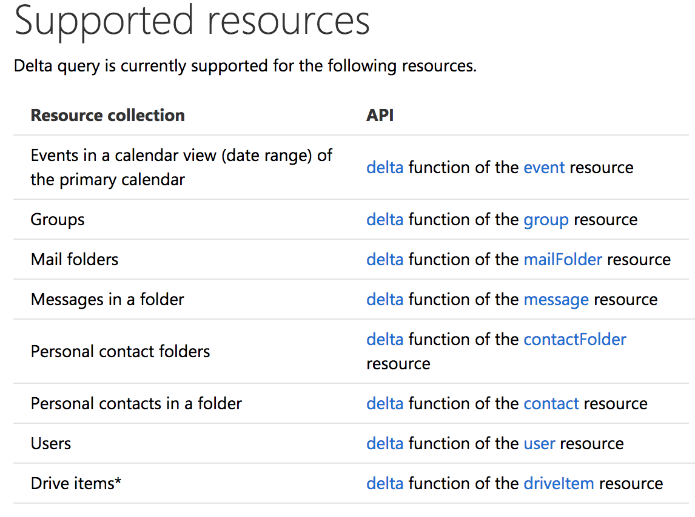

# microsoft-graph-overview

# github.com/User1m/microsoft-graph-notes

### You can use the Microsoft Graph API to interact with the data of millions of users in the Microsoft cloud. 


|Graph|Individual service endpoints|
|:-----------------:|:-------------------:|
|||

| Graph | Individual service endpoints|
| ---------------|-------------------|
| 100M monthly active users on Office 365 commercial, 400M Outlook.com active users, 8T resources (emails, events, users, files, groups, and more) |	Azure Active Directory, Outlook, OneDrive, OneNote, Office |


## [Graph Explorer](https://developer.microsoft.com/en-us/graph/graph-explorer)




## [Auth - OAuth 2.0](https://developer.microsoft.com/en-us/graph/docs/concepts/auth_overview)


### [Permissions](https://developer.microsoft.com/en-us/graph/docs/concepts/permissions_reference)

**Microsoft Graph exposes two kinds of permissions:**

1. `application` : requires administrator consent
2. `delegated` : For apps that run with a signed-in user, you request `delegated permissions` in the `scope` parameter. 


### Get access on behalf of a user (Delegated)

### App must acquire an access token from Azure Active Directory (Azure AD), Microsoft's cloud identity service. 

### 1. Register your app with the Azure AD v2.0 endpoint
* [https://apps.dev.microsoft.com/](https://apps.dev.microsoft.com/)



### 2. Get authorization

* Uses OpenID Connect and OAuth 2.0 flows
* Redirect the user to the Azure AD v2.0 `/authorize` endpoint
* Azure AD will sign the user in and ensure their consent for the permissions your app requests.
* If using code grant flow, after consent is obtained, Azure AD will return an `authorization_code` to your app that it can redeem at the Azure AD v2.0 `/token` endpoint for an access token.

#### [Authorization request](https://login.microsoftonline.com/common/oauth2/v2.0/authorize?client_id=6731de76-14a6-49ae-97bc-6eba6914391e&response_type=code&redirect_uri=http%3A%2F%2Flocalhost%2Fmyapp%2F&response_mode=query&scope=offline_access%20user.read%20mail.read&state=12345)

```
// Line breaks for legibility only

https://login.microsoftonline.com/{tenant}/oauth2/v2.0/authorize?
client_id=6731de76-14a6-49ae-97bc-6eba6914391e
&response_type=code
&redirect_uri=http%3A%2F%2Flocalhost%2Fmyapp%2F
&response_mode=query
&scope=offline_access%20user.read%20mail.read
&state=12345
```

#### Authorization response

```
GET http://localhost/myapp/?
code=M0ab92efe-b6fd-df08-87dc-2c6500a7f84d
&state=12345
```

### 3. Get a token

* Use the authorization `code` received in the previous step to request an access token by sending a `POST` request to the `/token` endpoint.


```
// Line breaks for legibility only

POST /common/oauth2/v2.0/token HTTP/1.1
Host: https://login.microsoftonline.com
Content-Type: application/x-www-form-urlencoded

client_id=6731de76-14a6-49ae-97bc-6eba6914391e
&scope=user.read%20mail.read
&code=OAAABAAAAiL9Kn2Z27UubvWFPbm0gLWQJVzCTE9UkP3pSx1aXxUjq3n8b2JRLk4OxVXr...
&redirect_uri=http%3A%2F%2Flocalhost%2Fmyapp%2F
&grant_type=authorization_code
&client_secret=JqQX2PNo9bpM0uEihUPzyrh    // NOTE: Only required for web apps
```

#### Token response

```
{
    "token_type": "Bearer",
    "scope": "user.read%20Fmail.read",
    "expires_in": 3600,
    "access_token": "eyJ0eXAiOiJKV1QiLCJhbGciOiJSUzI1NiIsIng1dCI6Ik5HVEZ2ZEstZnl0aEV1Q...",
    "refresh_token": "AwABAAAAvPM1KaPlrEqdFSBzjqfTGAMxZGUTdM0t4B4..."
}
```

### 4. Use the access token to call Microsoft Graph

*  Call Microsoft Graph by including token in the `Authorization` header of a request.

```
GET https://graph.microsoft.com/v1.0/me 
Authorization: Bearer eyJ0eXAiO ... 0X2tnSQLEANnSPHY0gKcgw
Host: graph.microsoft.com
```

### 5. Use the refresh token to get a new access token

* Access tokens are short lived, and you must refresh them after they expire to continue accessing resources. 
* You can do so by submitting another `POST` request to the `/token` endpoint, this time providing the `refresh_token`

**Request:**

```
// Line breaks for legibility only

POST /common/oauth2/v2.0/token HTTP/1.1
Host: https://login.microsoftonline.com
Content-Type: application/x-www-form-urlencoded

client_id=6731de76-14a6-49ae-97bc-6eba6914391e
&scope=user.read%20mail.read
&refresh_token=OAAABAAAAiL9Kn2Z27UubvWFPbm0gLWQJVzCTE9UkP3pSx1aXxUjq...
&redirect_uri=http%3A%2F%2Flocalhost%2Fmyapp%2F
&grant_type=refresh_token
&client_secret=JqQX2PNo9bpM0uEihUPzyrh      // NOTE: Only required for web apps
```

**Response:**

```
{
    "access_token": "eyJ0eXAiOiJKV1QiLCJhbGciOiJSUzI1NiIsIng1dCI6Ik5HVEZ2ZEstZnl0aEV1Q...",
    "token_type": "Bearer",
    "expires_in": 3599,
    "scope": "user.read%20mail.read",
    "refresh_token": "AwABAAAAvPM1KaPlrEqdFSBzjqfTGAMxZGUTdM0t4B4...",
}
```


### Get access without a user (Application)

1. Register your app.

2. Configure permissions for Microsoft Graph on your app.

	

3. Get administrator consent.

	* You can rely on an administrator to grant the permissions your app needs at the Azure portal;
	* A better option is to provide a sign-up experience for administrators by using the Azure AD v2.0 `/adminconsent` endpoint.

	**Request:**
	
	```
	// Line breaks are for legibility only.
	
	GET https://login.microsoftonline.com/{tenant}/adminconsent
	?client_id=6731de76-14a6-49ae-97bc-6eba6914391e
	&state=12345
	&redirect_uri=http://localhost/myapp/permissions
	```
	
	**Response:**
	
	```
	// Line breaks are for legibility only.

	GET http://localhost/myapp/permissions
	?tenant=a8990e1f-ff32-408a-9f8e-78d3b9139b95&state=state=12345
	&admin_consent=True
	```
	
	

4. Get an access token.

	**Token Request:**
	
	```
	// Line breaks are for legibility only.
	
	POST /{tenant}/oauth2/v2.0/token HTTP/1.1
	Host: login.microsoftonline.com
	Content-Type: application/x-www-form-urlencoded
	
	client_id=535fb089-9ff3-47b6-9bfb-4f1264799865
	&scope=https%3A%2F%2Fgraph.microsoft.com%2F.default
	&client_secret=qWgdYAmab0YSkuL1qKv5bPX
	&grant_type=client_credentials
	```

	**Token Response:**
	
	```
	{
	  "token_type": "Bearer",
	  "expires_in": 3599,
	  "access_token": "eyJ0eXAiOiJKV1QiLCJhbGciOiJSUzI1NiIsIng1dCI6Ik1uQ19WWmNBVGZNNXBP..."
	}
	```

5. Use the access token to call Microsoft Graph.


## [API Updates](https://developer.microsoft.com/en-us/graph/docs/concepts/changelog)

|[https://graph.microsoft.com/v1.0](https://graph.microsoft.com/v1.0)|[https://graph.microsoft.com/beta](https://graph.microsoft.com/beta)|
|-----------------|--------------|
|||

## [batching:](https://developer.microsoft.com/en-us/graph/docs/concepts/json_batching)
JSON batching allows you to optimize your application by combining multiple requests into a single JSON object.

* Can sequencing requests with the `dependsOn` property


```
POST https://graph.microsoft.com/beta/$batch
Accept: application/json
Content-Type: application/json
```
```
{
  "requests": [
    {
      "id": "1",
      "method": "GET",
      "url": "/me/drive/root:/{file}:/content"
    },
    {
      "id": "2",
      "method": "GET",
      "dependsOn": [ "1" ],
      "url": "/me/planner/tasks"
    },
    {
      "id": "3",
      "method": "GET",
      "url": "/groups/{id}/events"
    }
  ]
}
```

## [throttling:](https://developer.microsoft.com/en-us/graph/docs/concepts/throttling)

* When a throttling threshold is exceeded, Microsoft Graph limits any further requests from that client for a period of time. 
* When throttling occurs, Microsoft Graph returns HTTP status code `429 (Too many requests)`, and the requests fail. 
* A suggested wait time is returned in the response header of the failed request

#### [Best practices:](https://docs.microsoft.com/en-us/azure/architecture/patterns/throttling)

* Reduce the number of operations per request.
* Reduce the frequency of calls.
* Avoid immediate retries, because all requests accrue against your usage limits.
* Batching requests


## [webhooks:](https://developer.microsoft.com/en-us/graph/docs/api-reference/v1.0/resources/webhooks)

Deliver notifications to clients

##### Creating a subscription

* Microsoft Graph validates the notification URL in a subscription request before creating the subscription


**Request:**

```
POST https://graph.microsoft.com/v1.0/subscriptions
Content-Type: application/json
{
  "changeType": "created,updated",
  "notificationUrl": "https://webhook.azurewebsites.net/notificationClient",
  "resource": "/me/mailfolders('inbox')/messages",
  "expirationDateTime": "2016-03-20T11:00:00.0000000Z",
  "clientState": "SecretClientState"
}
```


## [delta queries:](https://developer.microsoft.com/en-us/graph/docs/concepts/delta_query_overview)

Track changes



```
GET /me/calendarView/delta?startDateTime={start_datetime}&endDateTime={end_datetime}
```

A GET request with the delta function returns either:

* A `nextLink` (that contains a URL with a delta function call and a skipToken), or
* A `deltaLin`k (that contains a URL with a delta function call and deltaToken).


## [extensions:](https://developer.microsoft.com/en-us/graph/docs/concepts/extensibility_overview)

A way for you to extend Microsoft Graph with your own application data.

Two types of extensions:

* [**Open extensions:**](https://developer.microsoft.com/en-us/graph/docs/concepts/extensibility_open_users) A good way for developers to get started.
* [**Schema extensions:**](https://developer.microsoft.com/en-us/graph/docs/concepts/extensibility_schema_groups) A more versatile mechanism for developers who care about storing typed data


**Request:** (open)

```
POST https://graph.microsoft.com/v1.0/me/extensions
Content-type: application/json
{
    "@odata.type":"microsoft.graph.openTypeExtension",
    "extensionName":"com.contoso.roamingSettings",
    "theme":"dark",
    "color":"purple",
    "lang":"Japanese"
}
```

**Retriving:** (open)

```
GET https://graph.microsoft.com/v1.0/me?$select=id,displayName,mail,mobilePhone&$expand=extensions
```


# Resources

### [Docs](https://developer.microsoft.com/en-us/graph/docs/concepts/overview)

### [Samples](https://github.com/microsoftgraph)

### [HTTP Error Messages](https://developer.microsoft.com/en-us/graph/docs/concepts/errors)


